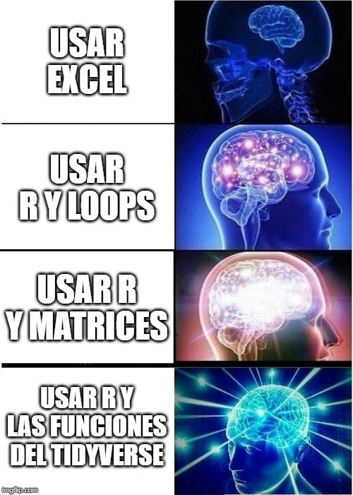

Programación II
===


##### Programa de Estudios Superiores

###### Ángelo Gutiérrez Daza

[marpit]: https://github.com/marp-team/marpit
[marp-vscode]: https://github.com/marp-team/marp-vscode

---

# Introducción (i)

- Podemos generar presentaciones a partir de documentos de Markdown
- Para ello, necesitaremos programas adicionales para poder convertir estos documentos en presentaciones
- La opcion que recomiendo es utilizar la extension [Marp para VS Code][marp-vscode]
- Esta presentación es adaptada del *template* oficial de Marp e ilustra algunas de las cosas que podemos hacer usando esta extensión

---

# Introducción (ii)

- Las sintaxis y etiquetas de **Markdown** se pueden seguir usando acá
- Podemos además usar iconos como :memo:, :factory:, :gear:, :goat:=Messi 
  -  La lista completa  se puede consultar [acá](https://github.com/ikatyang/emoji-cheat-sheet/blob/master/README.md) 
- También podemos incluir links a diapositvas [como este](#1) o a [páginas externas](https://gutierrez-daza.com/)
- La extensión [Marp para VS Code][marp-vscode] nos permite ver en tiempo real como se verá la presentación y exportarla a pdd, html y otros formatos

---

# Cómo escribir slides?

Usamos la regla horizontal para separar cada diapositiva:

```markdown
# Slide 1

Messi

---

# Slide 2

:goat:
```

---


# Directivas

- Se puede personalizar aspectos de las presentaciones utilizando  **"Directivas"** de Marp

- Estas se pueden ser **globales**, y se insertan al comienzo de la presentación

- También ùeden ser **locales**, en cuyo caso se insertan antes del encabezado de cada diapositiva

- Todas las directivas se pueden consultar en https://marpit.marp.app/directives

---

# Directivas Globales

- Por ejemplo, las **directivas globales** seleccionan el tema, las dimensiones de la presentacion, el texto de el encabezado y el de el pie de página, y desactivan el número de página

```
---
size: 16:9
theme: default
paginate: false
header: '**Algo de encabezado**'
footer: '_pie de pagina_'
---
```

- **16:9** o **4:3** son las dimensione más usuales para una presentación
- Para activar Marp, debe incluirse la directiva "marp: true" en el encabezado


---

<!-- _backgroundImage: "linear-gradient(to bottom, #67b8e3, #0288d1)" -->
# Directivas Locales (i)

- La siguiente directiva **local** cambia el fondo de la diapositiva
```
<!-- _backgroundImage: "linear-gradient(to bottom, #67b8e3, #0288d1)" -->
# Directivas Locales (i)
- La siguiente directiva **local** cambia el fondo de la diapositiva
---
```

---

<!-- _class: invert -->
# Directivas Locales (iI)

- Y esta invierte el esquema de colores del tema utilizado
```
<!-- _class: invert -->
# Directivas Locales (ii)
- Y esta invierte el esquema de colores del tema utilizado
```

<!-- _footer: Se puede esta directiva para introducir pie de página en una diapositiva)*" -->

---

# Estilo de una diapositiva

- Podemos usar también tags de CSS para modificar el estilo e una diapositva
- Como ejemplo, las siguientes lineas cambian el tamaño y color del título para esta diapositiva

```
<style scoped>
h1 {
  color: red;
  font-size: 50px;  
}
</style>
```
---

<style scoped>
h1 {
  color: red;
  font-size: 50px;  
}
</style>
# Estilo de una diapositiva

- Podemos usar también tags de CSS para modificar el estilo e una diapositva
- Como ejemplo, las siguientes lineas cambian el tamaño y color del título para esta diapositiva

```
<style scoped>
h1 {
  color: red;
  font-size: 50px;  
}
</style>
```
- Podemos consultar más opciones [acá](https://marpit.marp.app/theme-css) y [acá](https://marpit.marp.app/theme-css?id=tweak-style-through-markdown)
---

# [Imagenes](https://marpit.marp.app/image-syntax)

Se puede inserta imágenes desde la web o desde un directorio local

Se puede ajustar el tamaño de estas imagenes, así como aplicarles filtros de [CSS](https://en.wikipedia.org/wiki/Cascading_Style_Sheets) usando palabras clave como `width` (`w`), `height` (`h`)

```markdown

```

```markdown

```

Para más referencia, ver [syntax de las imagenes](Fig/FCB.jpg) y [una lista de filtros disponibles](https://marpit.marp.app/image-syntax?id=image-filters).

 

---

# [Imagen de Fondo](https://marpit.marp.app/image-syntax?id=slide-backgrounds)

Se puede insertar una imagen de fondo y usando la palabra clave `bg` .

```markdown

```


---

# [Slide dividido](https://marpit.marp.app/image-syntax?id=split-backgrounds)

Podemos insertar una imagen dividiendo el slide utilizando las palabras clave `bg` + `left` / `right`.

```markdown

```


---

# [Lista Fragmentada](https://marpit.marp.app/fragmented-list)

Podemos crear listas donde cada item aparece secuencialmente usando "*" en lugar de "-", pero solo serán visibles si se exporta la presentación a HTML

```markdown
# Lista Normal

- Me Dicen Cuba
- Tres Días
- Rosa la Peligrosa

---

# Lista fragmentada

* Me Dicen Cuba
* Tres Días
* Rosa la Peligrosa
```

---

# Formulas

Podemos ingresar formulas utilizando la syntaxis de TeX

$$ \max_{{ \lbrace C_{t} \rbrace}_{t=0}^{\infty}} E_{0} \sum_{t=0}^{\infty} U(C_t) $$

```tex
$ax^2+bc+c$
```
```tex
$$ \max_{{ \lbrace C_{t} \rbrace}_{t=0}^{\infty}} E_{0} \sum_{t=0}^{\infty} U(C_t) $$
```

---

#### Esto es todo....por ahora :sunglasses: <!--fit-->

Pueden consultar la documentación oficial y la plantilla de presentación oficial para ver más opciones de personalización